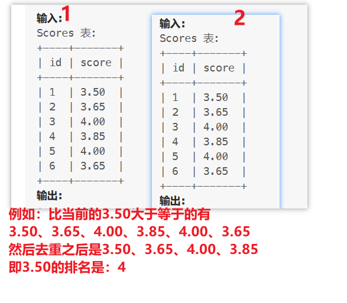

# 178. 分数排名

表: Scores
```sql
+-------------+---------+
| Column Name | Type    |
+-------------+---------+
| id          | int     |
| score       | decimal |
+-------------+---------+
```
在 SQL 中，id 是该表的主键。
该表的每一行都包含了一场比赛的分数。Score 是一个有两位小数点的浮点值。
 

查询并对分数进行排序。排名按以下规则计算:

> 分数应按从高到低排列。
如果两个分数相等，那么两个分数的排名应该相同。
在排名相同的分数后，排名数应该是下一个连续的整数。换句话说，排名之间不应该有空缺的数字。
示例 1:

输入: 
Scores 表:
```sql
+----+-------+
| id | score |
+----+-------+
| 1  | 3.50  |
| 2  | 3.65  |
| 3  | 4.00  |
| 4  | 3.85  |
| 5  | 4.00  |
| 6  | 3.65  |
+----+-------+
```
输出: 
```sql
+-------+------+
| score | rank |
+-------+------+
| 4.00  | 1    |
| 4.00  | 1    |
| 3.85  | 2    |
| 3.65  | 3    |
| 3.65  | 3    |
| 3.50  | 4    |
+-------+------+
```
解析：是哦也能够的方法是：子查询去重
解题思路：判断当前比当前成绩大的所有数据并去重之后的数量就是当前成绩的排名

# 解题：
```sql
select s.score ,(select count(distinct s2.score) 
                 from scores s2 
                 where s2.score >= s.score) as 'rank' 
from scores s 
order by s.score desc;
```